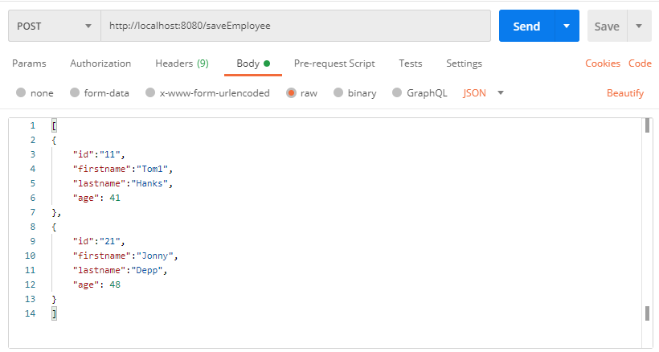
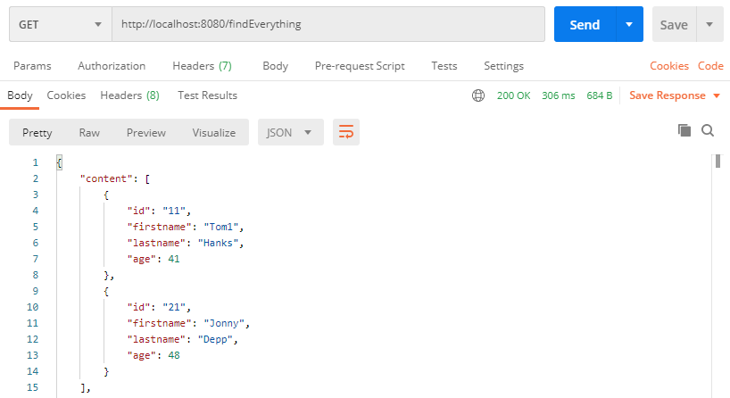
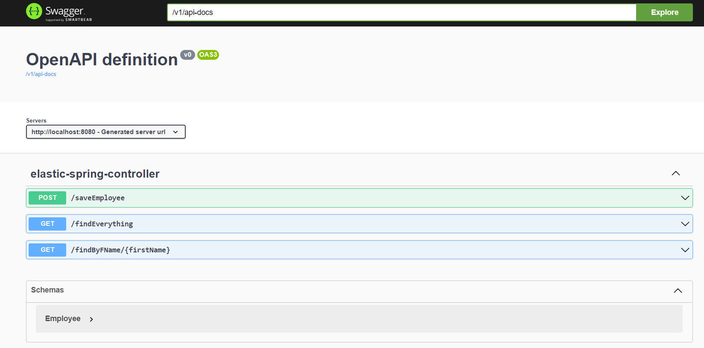

# elastic-springboot

## Start the elastic search in docker
```docker run -d --name es762 -p 9300:9300 -e "discovery.type=single-node" elasticsearch:7.6.2```

## Test Api




## Swagger UI
http://localhost:8080/swagger-ui.html


